# Limn

**A local, account-free MCP server that turns data into clean, presentation-ready charts — design judgment baked into the defaults.**

Limn is a [Model Context Protocol](https://modelcontextprotocol.io) server. Ask your LLM (Claude Desktop, Cursor, VS Code, any MCP client) to chart some data and get back something you'd put in a deck — a **PNG**, an editable **SVG**, and the **resolved spec** for one-change refinement. You give it data and a couple of semantic encodings; it owns the typography, color, spacing, labeling, and formatting.

- 🎨 **Design-first.** A small, opinionated tool surface and a rigorous design system (Okabe-Ito colorblind-safe palette, Inter typography, direct labeling, editorial framing). Few knobs, hard to make ugly.
- 🔒 **Fully local, no account.** Runs on your machine over stdio. **No network calls, no API key, no data leaving the box** — verifiable offline. The Vega data loader is disabled so a spec can't fetch a URL or read a file.
- ⚡ **No browser.** Renders Vega-Lite → SVG → PNG with a Rust rasterizer (`@resvg/resvg-js`). No Puppeteer/Chromium. Fast cold start, deterministic output.

> Status: **v0.2** — eight chart tools (`bar_chart`, `line_chart`, `scatter_plot`, `distribution`, `part_to_whole`, `slope_chart`, `dumbbell_plot`, `waterfall`) plus a themed Vega-Lite escape hatch. See [Roadmap](#roadmap).

## Before / after

Same data, same request — a bare Vega-Lite spec (what a generic chart server emits) versus Limn. The difference is entirely in defaults the model never touches: value-sorting, **direct labels instead of a legend**, SI number formatting, colorblind-safe palette, and editorial framing.

| Raw Vega-Lite default | Limn |
|---|---|
| 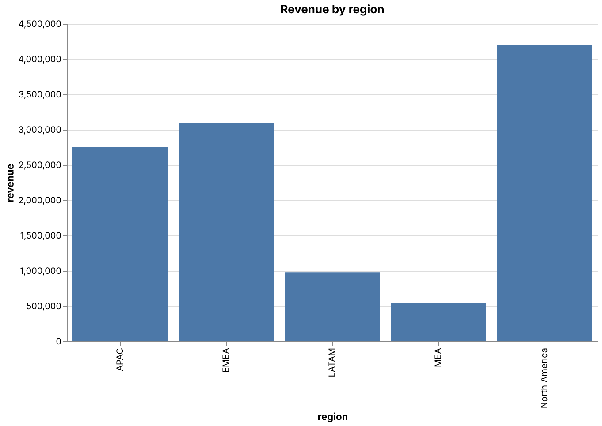 | 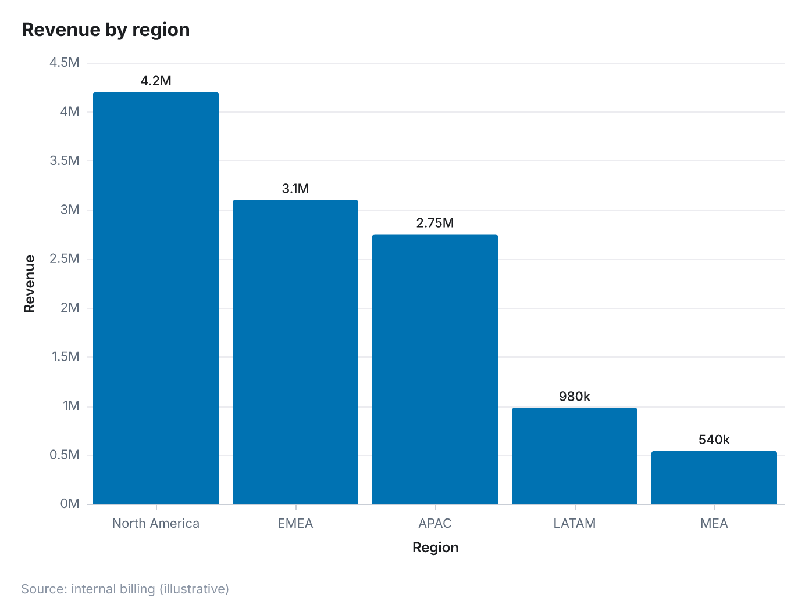 |
| 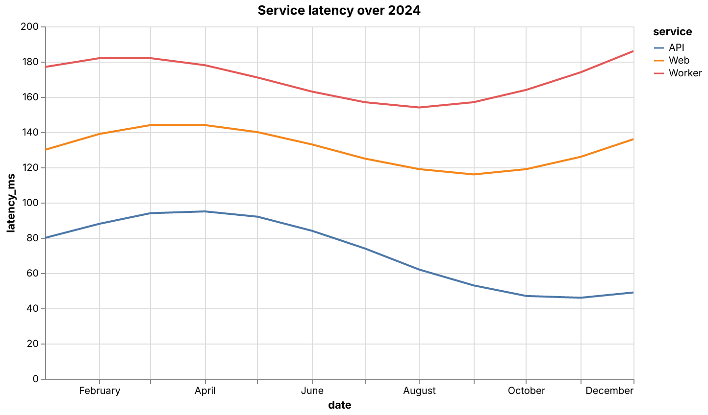 | 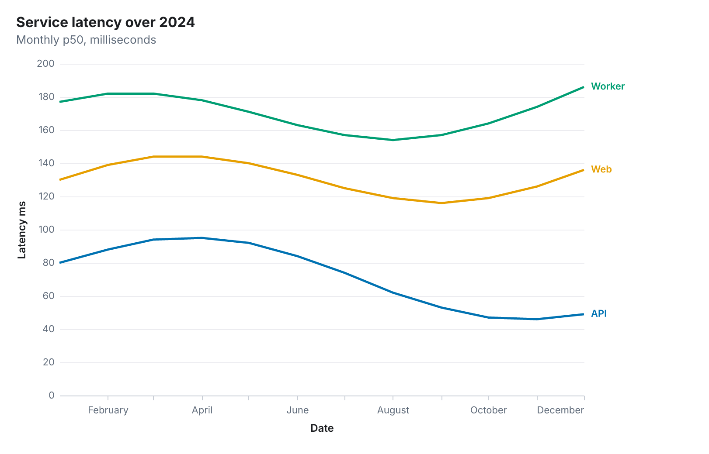 |

(And the signature charts — `waterfall`, `slope_chart` — have no clean raw-library equivalent at all.)

## Gallery

Every chart below was produced from data + 2–3 encodings — no styling input.

| | |
|---|---|
| **Bar** — sorted, zero-baseline, highlight one bar, direct value labels | **Line** — multi-series with end-of-line labels instead of a legend |
| 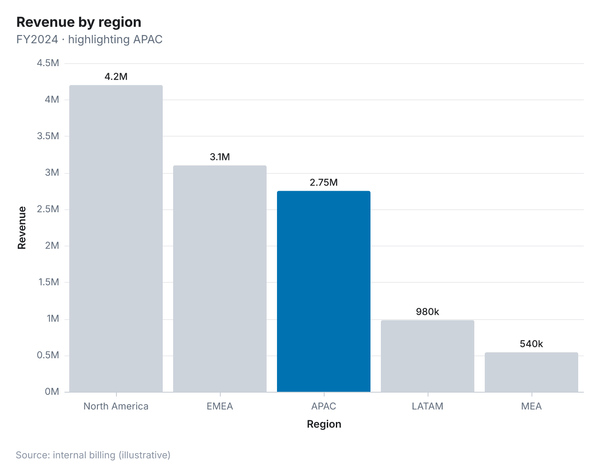 | 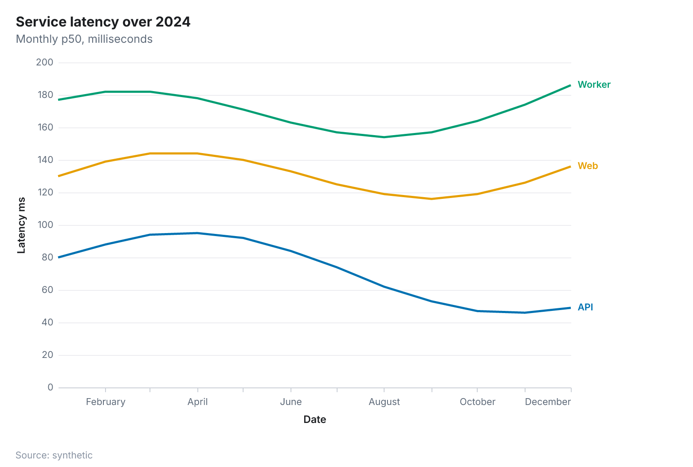 |
| **Scatter** — size + color encodings, trend line, overplotting opacity | **Distribution** — histogram (also box / density) |
| 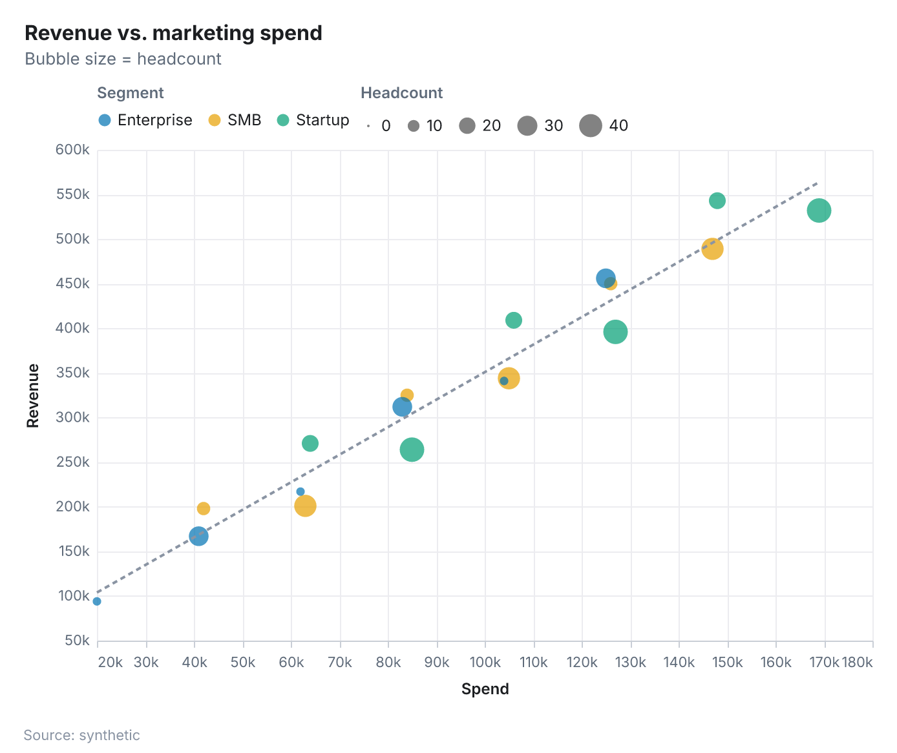 | 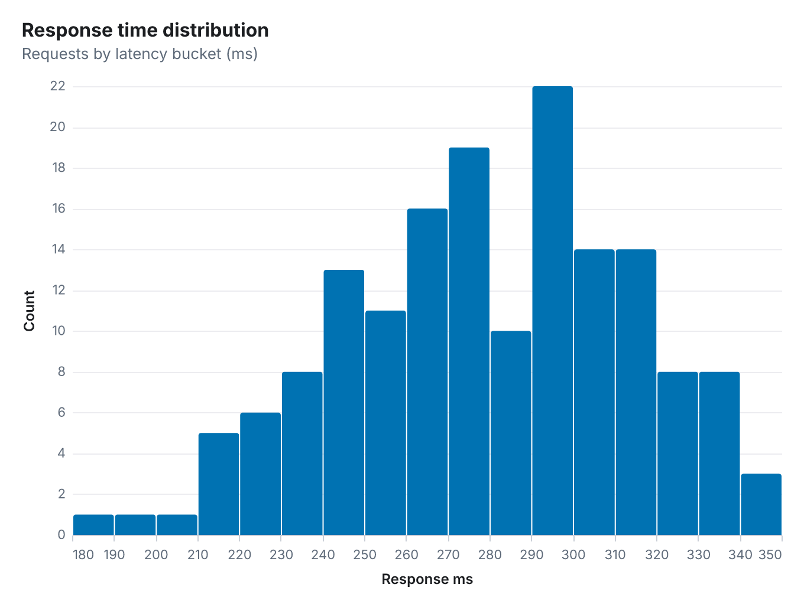 |
| **Part-to-whole** — donut with % legend and "Other" grouping | **Dumbbell** — two points per category, sorted by gap |
| 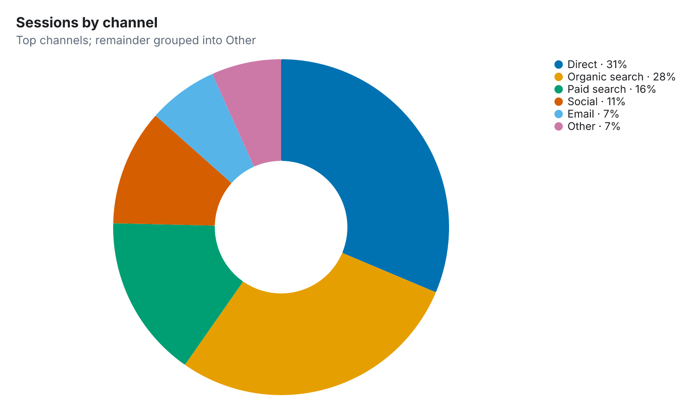 | 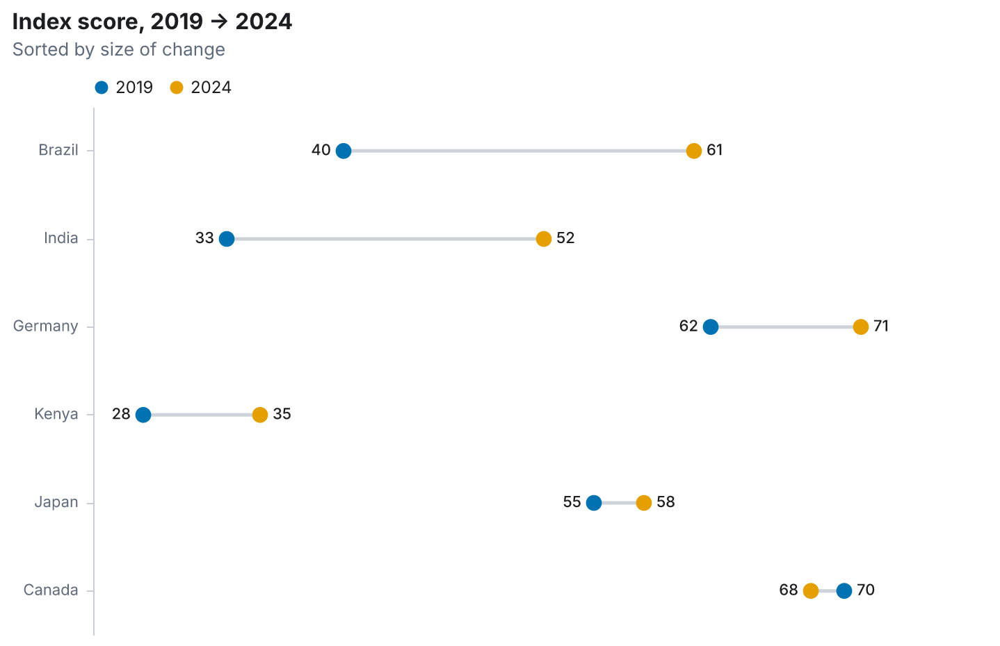 |
| **Waterfall** — signed steps, semantic colors, appended total | **Slope** — before/after, direction-of-change as the message |
| 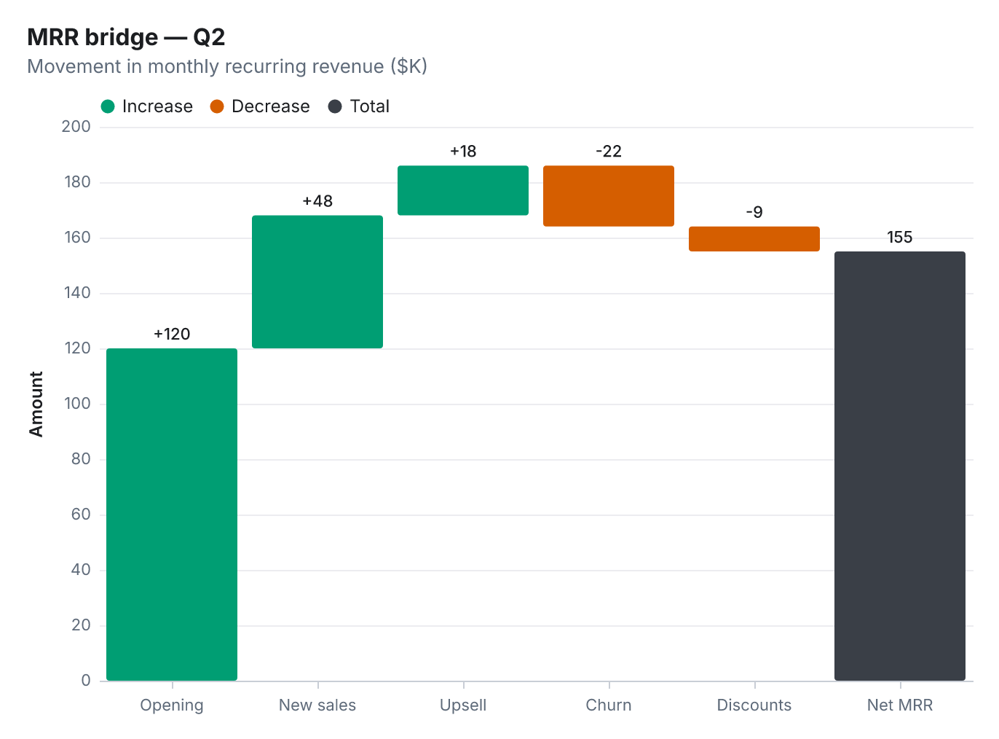 | 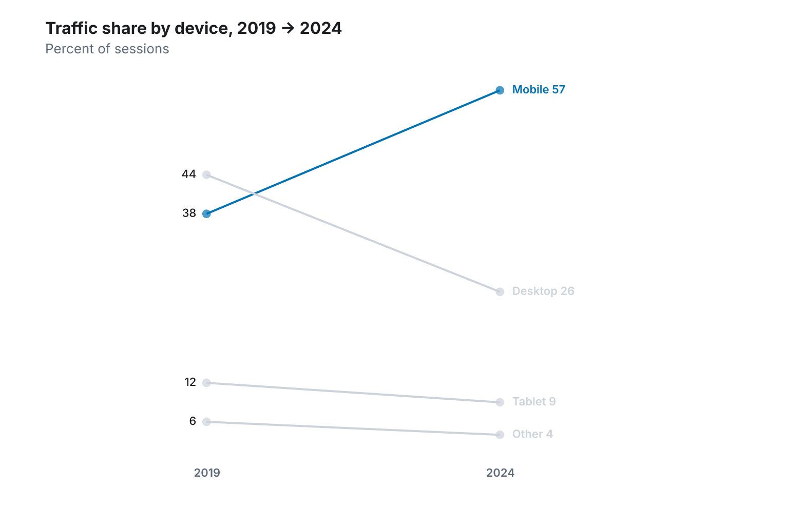 |
| **Grouped bar** — categorical Okabe-Ito palette, top legend | **Escape hatch** — any themed Vega-Lite spec (here, a donut) |
| 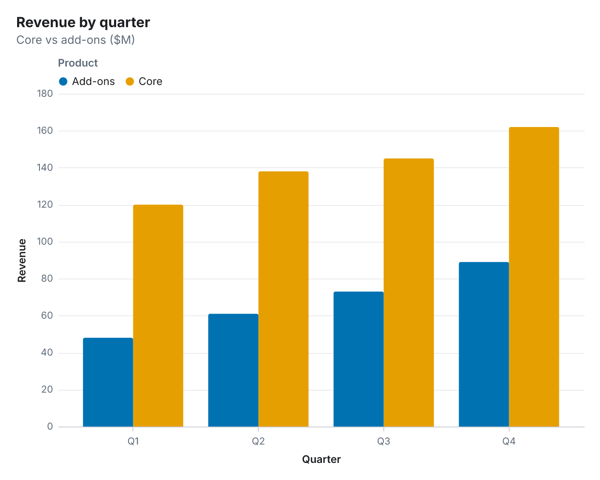 | 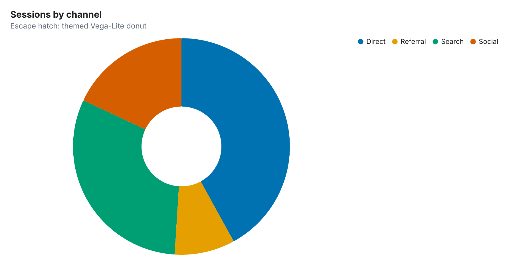 |

## Install

Limn runs via `npx` with zero config. Add it to your client:

**Claude Desktop** (`claude_desktop_config.json`):

```json
{
  "mcpServers": {
    "limn": { "command": "npx", "args": ["-y", "limn-mcp"] }
  }
}
```

**Cursor** (`~/.cursor/mcp.json` or `.cursor/mcp.json`):

```json
{
  "mcpServers": {
    "limn": { "command": "npx", "args": ["-y", "limn-mcp"] }
  }
}
```

**VS Code** (`.vscode/mcp.json`):

```json
{
  "servers": {
    "limn": { "type": "stdio", "command": "npx", "args": ["-y", "limn-mcp"] }
  }
}
```

Then just ask: *"chart revenue by region and highlight APAC,"* *"plot latency over time for each service,"* *"build a P&L waterfall,"* *"slope chart of market share 2019 vs 2024."*

### Local development

```bash
git clone https://github.com/farhad-gh-dev/limn
cd limn
npm install
npm run build           # → dist/
npm test                # privacy, determinism, schema, end-to-end MCP
npm run render          # regenerate the gallery in examples/
```

Point your client at the local build with `"command": "node", "args": ["/abs/path/to/limn/dist/index.js"]`, or inspect it with `npx @modelcontextprotocol/inspector node dist/index.js`.

## Tools

Each tool takes `data` (an array of rows) plus a few field names, and accepts optional `title` / `subtitle` / `source` and a closed `style` (`theme`, `width`, `height`). Every tool returns **PNG + SVG + resolved spec**.

| Tool | What it's for | Key inputs |
|---|---|---|
| `bar_chart` | Compare a value across categories | `x`, `y`, `series?`, `layout?`, `sort?`, `highlight?`, `valueLabels?` |
| `line_chart` | A value over an ordered axis (usually time) | `x`, `y`, `series?`, `area?`, `highlight?` |
| `scatter_plot` | Relationship between two numeric variables | `x`, `y`, `size?`, `color?`, `trendLine?` |
| `distribution` | Shape of one numeric variable | `value`, `kind?` (histogram/box/density), `series?` |
| `part_to_whole` | How categories make up a total | `category`, `value`, `kind?` (donut/bar), `maxSlices?` |
| `slope_chart` | Before/after across many series | `x` (two points), `y`, `series`, `highlight?` |
| `dumbbell_plot` | Two values per category; the gap is the message | `category`, `group` (two), `value`, `sort?`, `valueLabels?` |
| `waterfall` | Bridge a start to an end through signed steps | `label`, `value`, `showTotal?`, `totalLabel?` |
| `render_vega_spec` | Any chart outside the hero set, themed | `spec` (inline-data Vega-Lite JSON only) |

**Refinement loop.** Each call returns a *resolved spec* — pass it back to the same tool with one change (`"now highlight Q4"`, `"add a subtitle"`) instead of regenerating from scratch.

## Privacy

Limn makes no network requests on any chart path. The Vega loader's `load`/`http`/`file`/`sanitize` methods all reject, and `render_vega_spec` additionally pre-scans and rejects any spec referencing a `url` (including `file://`). You can run it on an air-gapped machine. The privacy guarantee is covered by automated tests (`test/privacy.test.ts`).

## How it looks designed

The quality is in defaults the model never touches:

- **Color:** Okabe-Ito categorical palette (colorblind-safe); a single accent drives "highlight one thing" while everything else falls to muted grey.
- **Direct labeling** over legends — values on bars, names at line ends.
- **Editorial framing** — title, subtitle, and a source line are first-class.
- **Restraint** — thin gridlines, no chart borders, generous margins, bundled Inter with a fixed type scale.
- **Opinionated correctness** — bars start at zero and sort by value; numbers get SI/compact formatting.

## Limitations (v0.2)

- **One theme** (`light`). Dark/print are on the roadmap.
- **No `accentColor` yet** — the accent is Okabe-Ito blue. (Accessible-clamped custom accents are planned.)
- **Label de-confliction is basic.** When two series have nearly identical values, slope/line end-labels can touch. Bespoke label placement is a roadmap item.
- **SVG references the `Inter` family.** The PNG is fully self-contained (glyphs are rasterized); for pixel-perfect SVG outside an environment that has Inter, use the PNG or install Inter.

## Roadmap

- **v0.2 (this release)** — added `scatter_plot`, `distribution`, `part_to_whole`, and the `dumbbell_plot` signature chart.
- **Next** — `dark`/`print` themes, accessible `accentColor`, and bespoke renderers with smarter label placement (de-conflict slope/line labels on near-equal values).
- **Later** — a `suggest_chart` advisor; optional self-hosted HTTP transport.

## Tech

TypeScript · [MCP SDK](https://github.com/modelcontextprotocol/typescript-sdk) · [Vega-Lite](https://vega.github.io/vega-lite/) → SVG · [`@resvg/resvg-js`](https://github.com/thx/resvg-js) → PNG · [fontkit](https://github.com/foliojs/fontkit) for DOM-free text metrics · bundled [Inter](https://github.com/rsms/inter) (OFL-1.1).

## License

[MIT](LICENSE). Free and open-source. Inter is bundled under the SIL Open Font License 1.1 (`fonts/OFL.txt`).
